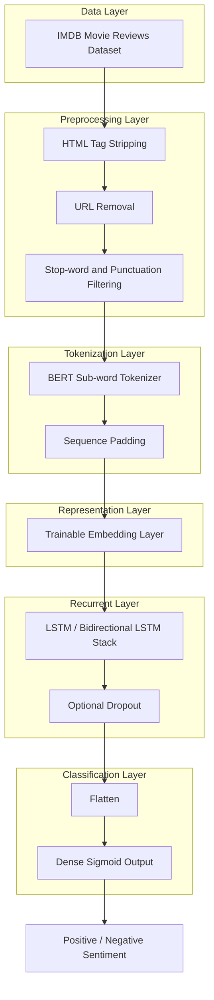

<div align="center">

</div>

---

# Sentiment Classification with BERT-Tokenized Bidirectional LSTM Network on IMDB

A systematic study of LSTM and Bidirectional LSTM architectures for binary sentiment classification on the IMDB movie review dataset, using BERT's sub-word tokenizer as the text-to-sequence encoding layer and comparing depth, hidden size, dropout, and learning rate across ten configurations.

<div align="left">

[](https://www.python.org/)
[](https://www.tensorflow.org/)
[](https://keras.io/)
[](https://huggingface.co/bert-base-uncased)
[](https://www.nltk.org/)
[](https://scikit-learn.org/)
[](https://www.kaggle.com/datasets/lakshmi25npathi/imdb-dataset-of-50k-movie-reviews)
[](#)
[](https://opensource.org/licenses/MIT)

</div>

## Abstract

Recurrent architectures remain a strong and interpretable baseline for text classification, yet their performance is highly sensitive to depth, capacity, and optimization settings. This project evaluates a family of LSTM and Bidirectional LSTM (Bi-LSTM) models for binary sentiment classification on 50,000 IMDB movie reviews. Raw reviews are cleaned through an HTML- and stop-word-aware preprocessing pipeline and encoded into sub-word token sequences using the pre-trained `bert-base-uncased` tokenizer, which are then padded and fed into a trainable embedding layer. Ten architectural and hyperparameter configurations are trained and compared, spanning unidirectional versus bidirectional recurrence, single versus stacked layers, hidden sizes from 8 to 256 units, dropout regularization, and two learning rates. The best configuration — a two-layer Bi-LSTM (256 → 128 units) trained with a learning rate of 0.001 — reaches **83.82% test accuracy**, while the results also reveal that a learning rate of 0.01 causes deeper and wider Bi-LSTM stacks to collapse into a non-learning state, highlighting a clear stability–capacity trade-off.

## Table of Contents

1. [Overview](#overview)
2. [Key Features](#key-features)
3. [System Architecture](#system-architecture)
4. [Text Preprocessing Pipeline](#text-preprocessing-pipeline)
5. [Model Architectures](#model-architectures)
   - 5.1 [Unidirectional LSTM Baseline](#51-unidirectional-lstm-baseline)
   - 5.2 [Single-Layer Bidirectional LSTM](#52-single-layer-bidirectional-lstm)
   - 5.3 [Stacked Bi-LSTM Variants](#53-stacked-bi-lstm-variants)
   - 5.4 [Regularization and Learning-Rate Sensitivity](#54-regularization-and-learning-rate-sensitivity)
6. [Experimental Setup](#experimental-setup)
7. [Results and Analysis](#results-and-analysis)
8. [Project Structure](#project-structure)
9. [Usage and Installation](#usage-and-installation)
10. [License](#license)
11. [Author](#author)
12. [Support](#support)

# Overview

This project frames IMDB sentiment classification as a sequence modeling problem and asks a practical question: given a fixed BERT-based tokenization front end, how do recurrence direction, depth, hidden size, dropout, and learning rate affect a Keras LSTM classifier's ability to generalize from training to unseen reviews?

The pipeline covers the full experimental cycle:

- Cleaning and normalizing 50,000 raw IMDB reviews (HTML stripping, URL removal, stop-word and punctuation filtering)
- Sub-word tokenization of the cleaned reviews with the `bert-base-uncased` tokenizer
- Sequence padding and a trainable embedding layer feeding LSTM / Bi-LSTM stacks
- Ten controlled architecture and hyperparameter variations
- Custom early-stopping on training accuracy to detect stagnating or diverging runs
- Comparative evaluation of training and held-out test accuracy across all configurations

---

# Key Features

* End-to-end text classification pipeline from raw review text to sentiment prediction
* BERT sub-word tokenization (`bert-base-uncased`) used as a vocabulary-efficient front end for a trainable embedding layer
* Custom text-cleaning pipeline combining HTML tag stripping, URL removal, and NLTK-based stop-word/punctuation filtering
* Ten controlled experiments across recurrence direction, depth, hidden size, dropout, and learning rate
* Custom Keras `EarlyStopping` callback to halt training when accuracy improvement stalls
* Side-by-side comparison of training vs. test accuracy to expose overfitting and optimization instability

---

# System Architecture

The system follows a linear NLP pipeline in which raw review text is cleaned, tokenized into BERT sub-word IDs, padded to a common length, and passed through a trainable embedding layer before entering the recurrent classification stack.



### Architectural Components

| Layer | Responsibility |
|:---------|:---------------|
| Data Layer | Loading the 50,000-review IMDB dataset and binarizing sentiment labels |
| Preprocessing Layer | HTML cleanup, URL removal, and stop-word/punctuation filtering |
| Tokenization Layer | BERT sub-word encoding and padding to a fixed sequence length |
| Representation Layer | Trainable word embeddings learned from scratch |
| Recurrent Layer | LSTM or Bidirectional LSTM stack, with optional dropout |
| Classification Layer | Flattening and a sigmoid output for binary sentiment prediction |

This design isolates the effect of the recurrent stack from the tokenization strategy: the BERT tokenizer contributes only its robust sub-word vocabulary and encoding utility, while the embedding and recurrent layers are trained entirely from scratch on the IMDB corpus.

---

# Text Preprocessing Pipeline

Before tokenization, every review passes through a cleaning function that:

1. Strips residual HTML markup using BeautifulSoup
2. Removes URLs via regular expressions
3. Lowercases the text and removes punctuation and English stop words using NLTK's stop-word corpus

The cleaned text is then encoded with `BertTokenizer.from_pretrained('bert-base-uncased')`, truncated to a maximum of 126 tokens with special tokens included, and padded post-sequence to the longest sample in the training split. Word-piece tokenization was chosen over a simple whitespace/frequency-based tokenizer to reduce out-of-vocabulary issues and produce more linguistically consistent sub-word units, while the embedding vectors themselves remain fully trainable rather than using BERT's pre-trained contextual representations.

---

# Model Architectures

All ten configurations share the same data split, preprocessing, and tokenization pipeline described above, and differ only in the recurrent stack and optimization settings.

## 5.1 Unidirectional LSTM Baseline

A single LSTM layer (64 units) establishes the baseline for comparison against bidirectional variants:

```python
model.add(Embedding(input_dim=bert_tokenizer.vocab_size, output_dim=100, input_length=max_seq_length))
model.add(LSTM(units=64, return_sequences=True))
model.add(Flatten())
model.add(Dense(1, activation='sigmoid'))
```

## 5.2 Single-Layer Bidirectional LSTM

Wrapping the same 64-unit LSTM in a `Bidirectional` layer allows the network to read each review both forward and backward before classification, isolating the effect of bidirectional context on accuracy.

## 5.3 Stacked Bi-LSTM Variants

Six configurations stack two Bidirectional LSTM layers with varying hidden sizes — symmetric pairs (64/64, 32/32, 8/8, 256/128) and an asymmetric funnel (64/32) — to study how capacity and layer-size ratio affect learning dynamics and generalization.

## 5.4 Regularization and Learning-Rate Sensitivity

Two additional configurations isolate individual factors: a `Dropout(0.3)` layer inserted after the stacked Bi-LSTM (64/64) to test overfitting control, and a reduced learning rate (`0.001` instead of `0.01`) applied to both the 64/64 and the 256/128 stacks to test optimization stability at higher model capacity. A custom `EarlyStopping` callback (`monitor='accuracy'`, `min_delta=0.001`, `patience=3`) halts training once accuracy stops improving meaningfully.

---

# Experimental Setup

| Component | Configuration |
|:---|:---|
| Dataset | IMDB Dataset of 50K Movie Reviews |
| Train / Test Split | 50% / 50% (`random_state=42`) |
| Tokenizer | `bert-base-uncased` (sub-word, max length 126) |
| Embedding | Trainable, output dimension 100 |
| Optimizer | Adam (`lr = 0.01` or `lr = 0.001`) |
| Loss Function | Mean Squared Error |
| Batch Size | 50 |
| Max Epochs | 10 (with custom accuracy-based early stopping) |
| Random Seed | 42 |

---

# Results and Analysis

### Configuration Comparison

| Model | Hidden Units | Learning Rate | Dropout | Train Accuracy | Test Accuracy | Test Loss |
|:---|:---|:---|:---|:---|:---|:---|
| LSTM (1 layer) | 64 | 0.01 | – | 0.9411 | 0.8094 | 0.1849 |
| Bi-LSTM (1 layer) | 64 | 0.01 | – | 0.9242 | 0.8150 | 0.1818 |
| Bi-LSTM (2 layers) | 64 / 64 | 0.01 | – | 0.5007 | 0.4993 | 0.5007 |
| Bi-LSTM (2 layers) | 64 / 64 | 0.01 | 0.3 | 0.8984 | 0.8038 | 0.1931 |
| Bi-LSTM (2 layers) | 64 / 64 | 0.001 | – | 0.9863 | 0.8315 | 0.1514 |
| Bi-LSTM (2 layers) | 64 / 32 | 0.01 | – | 0.9639 | 0.8249 | 0.1607 |
| Bi-LSTM (2 layers) | 32 / 32 | 0.01 | – | 0.9739 | 0.8146 | 0.1721 |
| Bi-LSTM (2 layers) | 8 / 8 | 0.01 | – | 0.9833 | 0.8318 | 0.1525 |
| Bi-LSTM (2 layers) | 256 / 128 | 0.01 | – | 0.5007 | 0.4993 | 0.5007 |
| **Bi-LSTM (2 layers)** | **256 / 128** | **0.001** | **–** | **0.9869** | **0.8382** | **0.1485** |

### Observations

- At `lr = 0.01`, both the 64/64 and 256/128 stacked Bi-LSTM models fail to leave a degenerate solution (accuracy stuck at ≈50%), while the same architectures trained at `lr = 0.001` converge normally and produce the two best test accuracies overall — indicating that deeper, higher-capacity Bi-LSTM stacks are considerably more sensitive to the optimizer's step size.
- Adding `Dropout(0.3)` to the 64/64 stack recovers stable training compared to its undropped, high-lr counterpart, but still trails the low-lr version, suggesting the instability at `lr = 0.01` is primarily an optimization issue rather than one that regularization alone resolves.
- Bidirectional context provides a small but consistent gain over the unidirectional baseline (81.50% vs. 80.94% test accuracy) at equal capacity.
- All configurations show a noticeably higher training accuracy than test accuracy, reflecting the limited regularization used across most runs and the relatively small, cleaned vocabulary available for a two-class sentiment task.
- The best-performing configuration — a 256/128 stacked Bi-LSTM at `lr = 0.001` — achieves **83.82% test accuracy**, the highest among all ten configurations tested.

---

# Project Structure

```
IMDB-Sentiment-Classification-with-BERT-Tokenized-Bidirectional-LSTM-Network
│
├── IMDB_Sentiment_BiLSTM_BERT_Tokenization.ipynb
└── README.md
```

---

# Usage and Installation

```bash
# 1. Clone the repository
git clone https://github.com/farzadjannati/IMDB-Sentiment-Classification-with-BERT-Tokenized-Bidirectional-LSTM-Networks.git
cd IMDB-Sentiment-Classification-with-BERT-Tokenized-Bidirectional-LSTM-Networks

# 2. Create and activate environment
conda create -n imdb-bilstm python=3.10
conda activate imdb-bilstm

# 3. Install dependencies
pip install -r requirements.txt
# Core deps: tensorflow, keras, transformers, nltk, scikit-learn, beautifulsoup4, pandas
```

### Dataset

Download the **IMDB Dataset of 50K Movie Reviews** from Kaggle and place `IMDB_Dataset.csv` in your working directory (the notebook expects it under Google Drive when run on Colab):
[kaggle.com/datasets/lakshmi25npathi/imdb-dataset-of-50k-movie-reviews](https://www.kaggle.com/datasets/lakshmi25npathi/imdb-dataset-of-50k-movie-reviews)

The tokenizer weights are pulled automatically from the Hugging Face Hub on first run:
[huggingface.co/bert-base-uncased](https://huggingface.co/bert-base-uncased)

### Reproducibility

Run the notebook cells sequentially; each experiment reloads and re-splits the data with `random_state=42` for consistency. A GPU runtime (e.g., Google Colab T4) is recommended to keep training times manageable.

---

# License

This project is licensed under the MIT License.

---

## Author

**Parmida Ghamari**
M.Sc. Student, University of Tehran
Research Assistant @ Social Networks Lab

**Research Interests:** NLP, Sentiment Analysis, Recurrent Neural Networks (LSTM/Bi-LSTM), Transformer-Based Text Tokenization, Deep Learning for Text Classification, Natural Language Understanding

📧 [Parmida.ghamari@gmail.com](mailto:Parmida.ghamari@gmail.com) | 💻 [github.com/ParmidaGh](https://github.com/ParmidaGh) | 💼 [www.linkedin.com/in/parmida-ghamari](https://www.linkedin.com/in/parmida-ghamari)

---

# Support

If you find this project useful, consider giving it a star ⭐

---

<p align="center">
Builtusing TensorFlow, Keras, and Hugging Face Transformers
</p>
